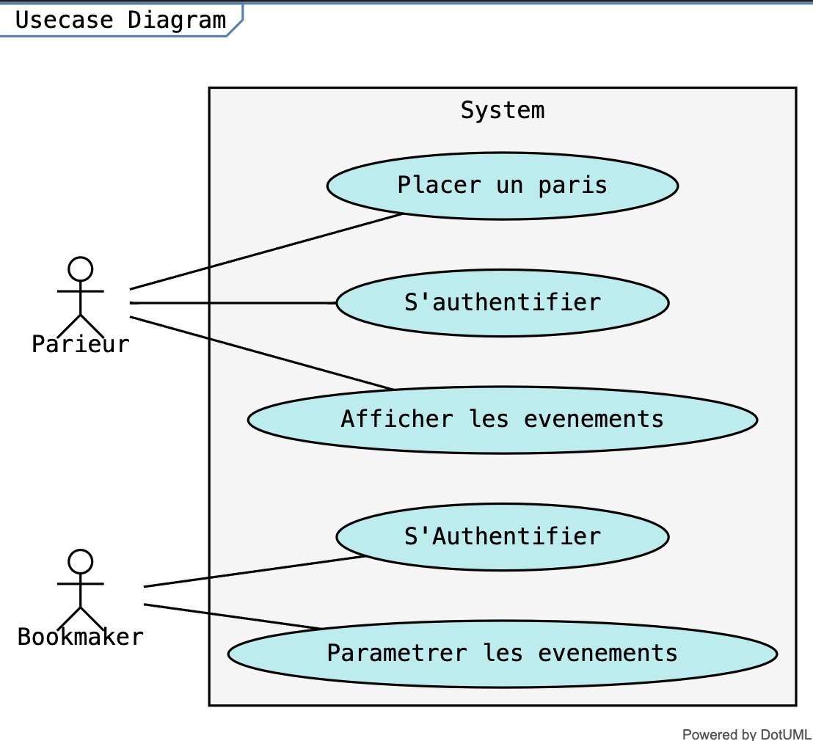
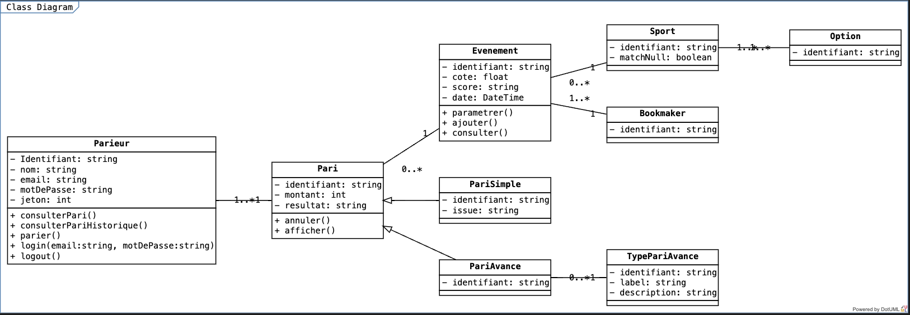
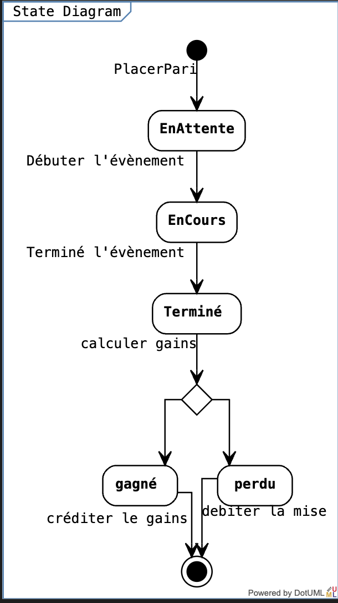
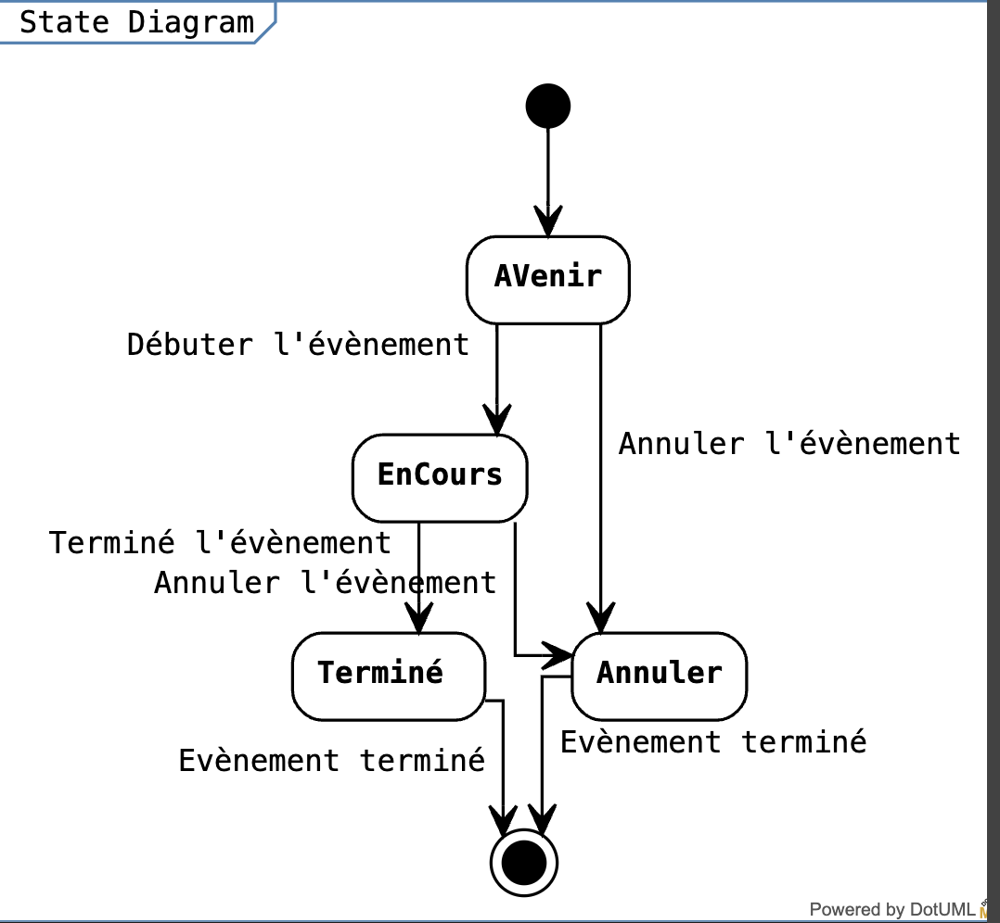

# Modélisation UML - Paris Sportif

## Description
Ce projet présente une modélisation UML détaillée pour un système de paris sportif. Il inclut des diagrammes pour illustrer les interactions entre les acteurs, les cas d'utilisation, les clasess, les séquences d'événements et les états des objets. De plus, il présente un prototype développé avec OpenXava pour démontrer la mise en œuvre de la modélisation.

## Table des Matières
- [Les acteurs](#les-acteurs)
- [Le diagramme de cas d'utilisation](#le-diagramme-de-cas-dutilisation)
- [Le diagramme de casses](#le-diagramme-de-classes)
- [Le diagramme de séquence](#le-diagramme-de-séquence)
- [Le diagramme d'etat](#le-diagramme-détat)
- [Prototype avec OpenXava](#prototype-avec-openxava)
- [Démonstration du Prototype](#démonstration-du-prototype)

## Les Acteurs
Notre système comprend deux acteurs principaux : le parieur et le bookmaker, ainsi qu'un acteur secondaire, le "système tiers". Cependant, dans la suite de notre diagramme de cas d'utilisation, nous avons mis l'accent sur les acteurs principaux.

## Le Diagramme de Cas d'Utilisation

## Le diagramme de classes
Notre diagramme de classe comprend un total de 9 classes, dont deux (pari simple et pari avancé) qui héritent de la classe parente "pari".

## Le Diagramme de Séquence
Nous avons modélisé deux diagrammes de séquence en nous assurant de gérer tous les cas alternatifs possibles.

### Placer un pari

### Configurer un evenement

## Le Diagramme d'État

### Paris

### Evenements

## Prototype avec OpenXava
Nous avons utilisé OpenXava pour mettre en place un prototype de notre application. Pour générer les classes nécessaires à nos modèles OpenXava, nous avons développé un générateur de code qui transcrit notre code dotUML en un code Java exécutable sur OpenXava. Le générateur de code a été écrit en Python et se situe dans le dossier "generator" à la racine du projet. Il est à noter que le générateur n'est efficace qu'à 70%, ce qui nécessite des modifications manuelles pour parfaire nos classes.

## Démonstration du Prototype
La démonstration du prototype illustre comment les utilisateurs interagissent avec le système. Elle peut inclure des captures d'écran ou des vidéos montrant les fonctionnalités clés du système.
