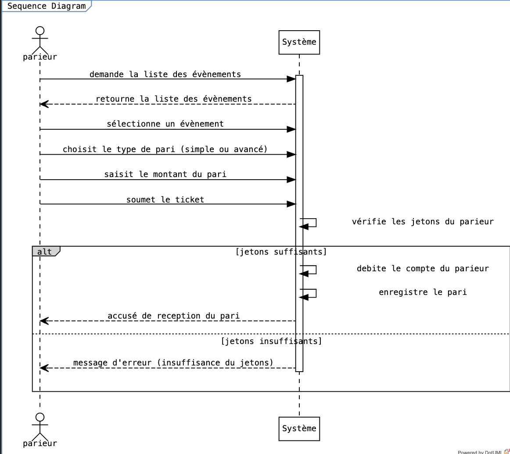
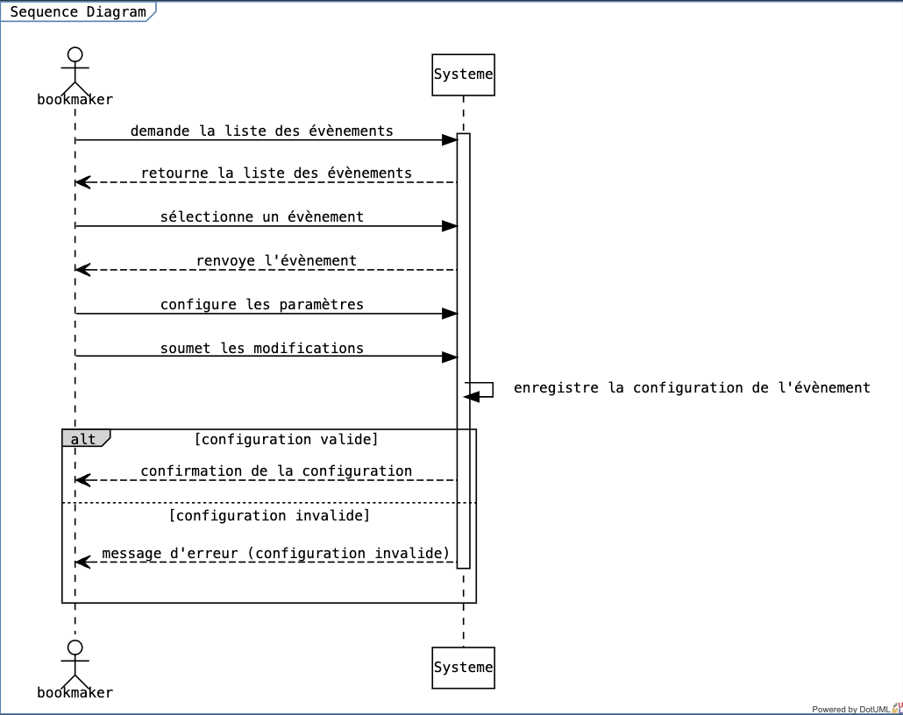

# Modélisation UML - Paris Sportif

## Description
Ce projet présente une modélisation UML détaillée pour un système de paris sportif. Il inclut des diagrammes pour illustrer les interactions entre les acteurs, les cas d'utilisation, les clasess, les séquences d'événements et les états des objets. De plus, il présente un prototype développé avec OpenXava pour démontrer la mise en œuvre de la modélisation.

## Table des Matières
- [Les acteurs](#les-acteurs)
- [Le diagramme de cas d'utilisation](#le-diagramme-de-cas-dutilisation)
- [Le diagramme de classes](#le-diagramme-de-classes)
- [Le diagramme de séquences](#le-diagramme-de-séquence)
- [Le diagramme d'etats](#le-diagramme-détat)
- [Prototype avec OpenXava](#prototype-avec-openxava)
- [Démonstration du Prototype](#démonstration-du-prototype)
- [Credis](#credits)

## Les Acteurs
Notre système comprend deux acteurs principaux : le parieur et le bookmaker, ainsi qu'un acteur secondaire, le "système tiers". Cependant, dans la suite de notre diagramme de cas d'utilisation, nous avons mis l'accent sur les acteurs principaux.

## Le Diagramme de Cas d'Utilisation

## Le diagramme de classes
Notre diagramme de classe comprend un total de 9 classes, dont deux (pari simple et pari avancé) qui héritent de la classe parente "pari".

## Le Diagramme de Séquence
Nous avons modélisé deux diagrammes de séquence en nous assurant de gérer tous les cas alternatifs possibles.

### Placer un pari

Ce diagramme de séquence décrit l'interaction entre un parieur et le systeme pour placer un pari. Il suit le flux d'actions depuis la demande de la liste des événements jusqu'à la soumission du ticket de pari, en passant par la sélection de l'événement, le choix du type de pari (simple ou avancé), la saisie du montant du pari et la vérification des jetons du parieur. Il inclut également deux cas alternatifs : l'un pour des jetons suffisants, où le système débite le compte du parieur et enregistre le pari, et l'autre pour des jetons insuffisants, où le système renvoie un message d'erreur indiquant l'insuffisance de jetons.

### Configurer un evenement

Ce diagramme de séquence décrit l'interaction entre un bookmaker et le système. Il suit le flux d'actions à travers différentes étapes telles que la demande de la liste des événements, la sélection d'un événement, la configuration des paramètres et la soumission des modifications. De plus, il inclut deux cas alternatifs : l'un pour une configuration valide, où le système confirme la configuration, et l'autre pour une configuration invalide, où le système renvoie un message d'erreur. 

## Le Diagramme d'État

### Paris

Ce diagramme d'états modélise le processus de paris, avec des états tels que "En Attente", "En Cours", et "Terminé", ainsi que des états de résultat "Gagné" et "Perdu". Après la fin de l'événement, un choix est effectué pour déterminer si le pari est gagné ou perdu, conduisant à des états de résultat appropriés où les gains sont crédités ou la mise est débitée. Les transitions sont clairement définies pour refléter les différentes situations possibles lors du déroulement du pari.

### Evenements

Ce diagramme d'états modélise le cycle de vie d'un événement, passant par les états "À Venir", "En Cours", "Terminé" et "Annulé". Les transitions décrivent les actions telles que le démarrage, la fin et l'annulation de l'événement, permettant une visualisation claire et concise de son déroulement. Le choix des états et des transitions est logique et facilite la compréhension des différentes phases de l'événement.

## Prototype avec OpenXava
Nous avons utilisé OpenXava pour mettre en place un prototype de notre application. Pour générer les classes nécessaires à nos modèles OpenXava, nous avons développé un générateur de code qui transcrit notre code dotUML en un code Java exécutable sur OpenXava. Le générateur de code a été écrit en Python et se situe dans le dossier "generator" à la racine du projet. Il est à noter que le générateur n'est efficace qu'à 70%, ce qui nécessite des modifications manuelles pour parfaire nos classes.

Script : https://github.com/L3-MIAGE-UNIVERSITE-RENNES/paris-en-ligne/blob/main/generator/generator.py

## Démonstration du Prototype
video : https://drive.google.com/file/d/1DiKNCTO5Hs18S3exE52T_V7hQIq_EHSF/view?usp=sharing

## Credits
- TRO EMMANUEL
- DIENG YAMA
